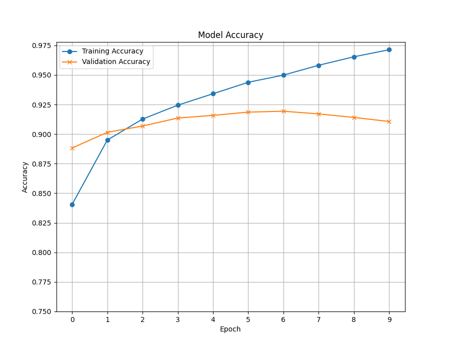

# Project 2: FASHION MNST IMAGE CLASSIFICATION
## Note: There is User Input for number of epochs 

### Q1. Number of trainable parameters in the model
Number of trainable parameters: **394530**
### Q2. Trends between Training and Validation Accuracy At The End Of Each Epoch

### Q3. Evaluate accuracy on the test set
Final Test Accuracy: **0.909500002861023**

Other Tests (Playing around with the layers):
- Final Test Accuracy: 0.9041000008583069 @ 5 epochs using 2 additional convolution layers + 1 additional maxpooling layer
- Final Test Accuracy: 0.9041000008583069 @ 20 epochs using 2 additional convolution layers + 1 additional maxpooling layer

### Q4.Examples of Misclassifcation (Test Set)

- 0   T-shirt/top
- 1	Trouser
- 2	Pullover
- 3	Dress
- 4	Coat
- 5	Sandal
- 6	Shirt
- 7	Sneaker
- 8	Bag
- 9	Ankle boot

### Observations
In Q2 we plotted the trends between training accuracy vs validation accuracy, this provided us valuable information to what's happening within our CNN model. It seems that past Epoch 2 to 10, the training accuracy continues at a linear rate while validation accuracy begins to plataeu. This is roughly a 5% discrepancy which is insightful for us. This highlights a crucial issue that arises in our model of the data it's able to classify. As our model progresses, it's unable to improve classifying unshown information in our validation set, only improving on already learned information(overfitting). This issue is also related with Q4, where we projected examples of where our model fails to misclassify the clothing. An example is our model mistaken sandals to be as boots, this where I recognized an issue could be due to the lack of understanding small details. Sandals holds several unique characteristics such as flatter bottom, lack of covering on the top, and short in height. I think we could improve our model through data augmentation introducing different kinds of data from our existing one. Specifically padding, from my understand can help add in pixels to outter edges of an image to keep its shape(?).

### Resources
1. https://stackoverflow.com/questions/37891954/keras-how-do-i-predict-after-i-trained-a-model/

2. https://stackoverflow.com/questions/44747343/keras-input-explanation-input-shape-units-batch-size-dim-etc

3. https://keras.io/guides/sequential_model

4. https://www.reddit.com/r/learnmachinelearning/comments/fjfr3y/can_someone_explain_train_and_validation_accuracy/

5. https://medium.com/accredian/increase-the-performance-of-image-classification-models-b466e1ae3101

6. https://aws.amazon.com/what-is/overfitting/