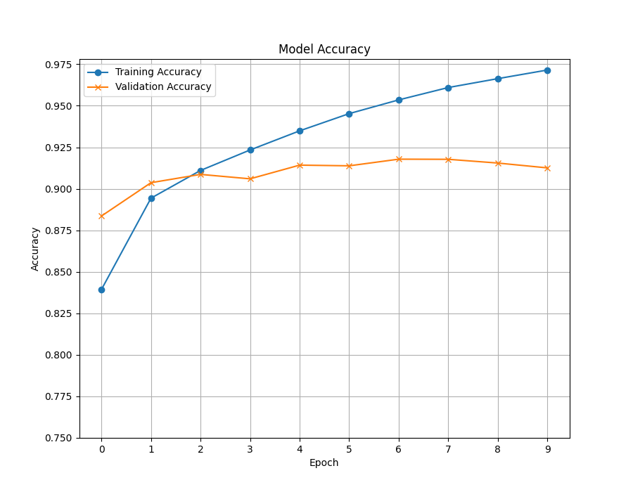

# Print the number of trainable parameters in the model
Number of trainable parameters: 394530

# Evaluate training and validation accuracy at the end of each epoch, and plot them as line plots on the same set of axes.

# Evaluate accuracy on the test set.
313/313 ━━━━━━━━━━━━━━━━━━━━ 1s 1ms/step - accuracy: 0.9103 - loss: 0.3278

# Show an example from the test set for each class where the model misclassifies.

# Comment on any other observations about the model performance
-first run through final epoch resulted in an accuracy around 0.977~ 
-Inconsistency between multiple runs, it tends to perform better when I'm not playing video games (LOL).
    However, I read that you could use your GPU to run these computations instead of your CPU through "CUDA"
    so I plan on implementing that. 
-I asked other classmates through the discord to capture a general range for the final test accuracy.